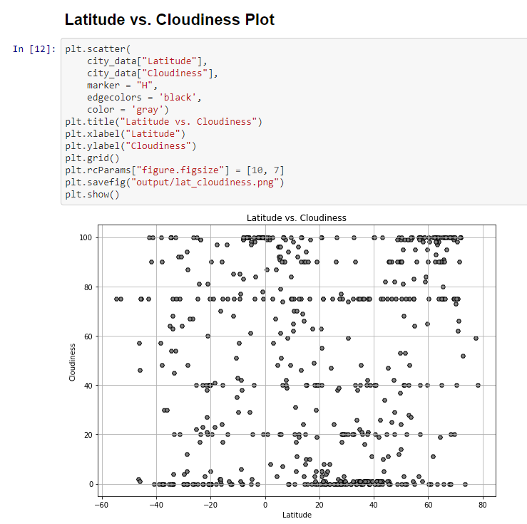

# Python API - Experiment

## Background

Data's true power lies in its ability to answer questions definitively. Use Python requests, APIs, and JSON traversals to answer a fundamental question: "What's the weather like as we approach the equator?" The obvious answer is "It gets hotter..." but we want to **prove** it.

**Note**: If you would like to run the included Jupyter Notebook files, you will need to provide your own API keys for [OpenWeatherMap API](https://openweathermap.org/api) and [Google API](https://console.developers.google.com/).

Also, if you having trouble displaying the maps try running `jupyter nbextension enable --py gmaps` in your environment and retry.

## Part I - Prove it!

* Create a Python script to visualize the weather of 500+ cities across the world of varying distance from the equator using [simple Python library](https://pypi.python.org/pypi/citipy) and the [OpenWeatherMap API](https://openweathermap.org/api)to create a representative model of weather across world cities.

* Create a series of scatter plots to showcase the following relationships:

- [x] Temperature (F) vs. Latitude
- [x] Humidity (%) vs. Latitude
- [x] Cloudiness (%) vs. Latitude
- [x] Wind Speed (mph) vs. Latitude

* Run linear regression on each relationship, only this time separating them into Northern Hemisphere (greater than or equal to 0 degrees latitude) and Southern Hemisphere (less than 0 degrees latitude):

- [x] Northern Hemisphere - Temperature (F) vs. Latitude
- [x] Southern Hemisphere - Temperature (F) vs. Latitude
- [x] Northern Hemisphere - Humidity (%) vs. Latitude
- [x] Southern Hemisphere - Humidity (%) vs. Latitude
- [x] Northern Hemisphere - Cloudiness (%) vs. Latitude
- [x] Southern Hemisphere - Cloudiness (%) vs. Latitude
- [x] Northern Hemisphere - Wind Speed (mph) vs. Latitude
- [x] Southern Hemisphere - Wind Speed (mph) vs. Latitude

* Randomly select **at least** 500 unique (non-repeat) cities based on latitude and longitude.

* Perform a weather check on each of the cities using a series of successive API calls.

* Include a print log of each city as it's being processed with the city number and city name.

* Save a CSV of all retrieved data and a PNG image for each scatter plot.

### Part II - Plan a Vacation

* Create a heat map that displays the humidity for every city from the Part I.

  

* Narrow down the DataFrame to find the ideal weather condition. For example:

- [x] A max temperature lower than 80 degrees but higher than 70.
- [x] Wind speed less than 10 mph.
- [x] Zero cloudiness.
- [x] Drop any rows that don't contain all three conditions.

* Use Google Places API to find the first hotel for each city located within 5000 meters of the coordinates.

* Plot the hotels on top of the humidity heatmap with each pin containing the **Hotel Name**, **City**, and **Country**.

  

As final considerations:

* Must be completed in Jupyter notebook.
* Must use the Matplotlib or Pandas plotting libraries.

## Considerations

* Must be completed in Jupyter notebook.

* Must use the Matplotlib or Pandas plotting libraries.

* Remember that each coordinate will trigger a separate call to the Google API.

   ### Screenshots and Comparisons

---

API Calls           |  Convert to Dataframe
:-------------------------:|:-------------------------:
  |  

---

Sample Plots by Latitude          |   
:-------------------------:|:-------------------------:
  |  
  |  
  |   

---